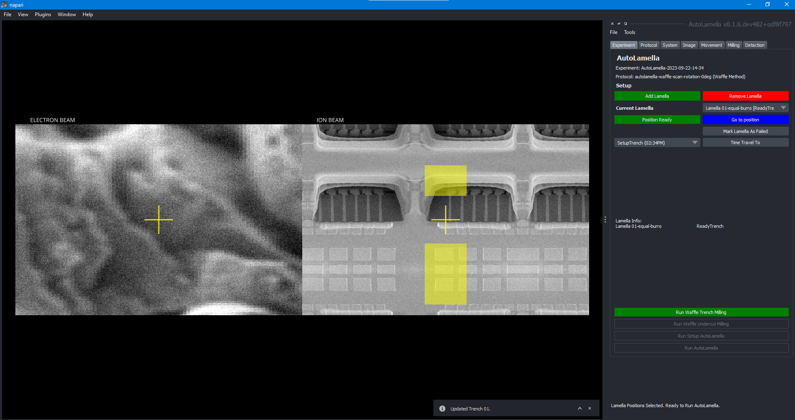

[](https://pypi.python.org/pypi/autolamella/)

# Overview

AutoLamella is a python package for automated cryo-lamella preparation with focused ion beam milling. It is based on [openFIBSEM](https://github.com/DeMarcoLab/fibsem), and currently supports the [TESCAN Automation SDK](https://www.tescan.com/en/products/automation-sdk/) and [ThermoFisher AutoScript](https://www.tescan.com/en/products/autoscript/). Support for other FIBSEM systems is planned.

## Documentation

[Documentation Site](https://demarcolab.github.io/openfibsem-docs/)

## Install

### Recommended Installation Guide

Create a new virtual environment from the Anaconda Prompt terminal:

```bash 
conda create -n fibsem python=3.9 pip
conda activate fibsem
pip install autolamella 
```

### Running Autolammela

Open the Anaconda Prompt terminal and run the following commands.

``` bash
conda activate fibsem
autolamella_ui

```



## Citation

If you find this useful, please cite our work.

Genevieve Buckley, Gediminas Gervinskas, Cyntia Taveneau, Hariprasad Venugopal, James C. Whisstock, Alex de Marco,
**Automated cryo-lamella preparation for high-throughput in-situ structural biology**,
*Journal of Structural Biology*,
Volume 210, Issue 2,
2020
<https://doi.org/10.1016/j.jsb.2020.107488>.

See [CITATION](CITATION.md) for more details.
