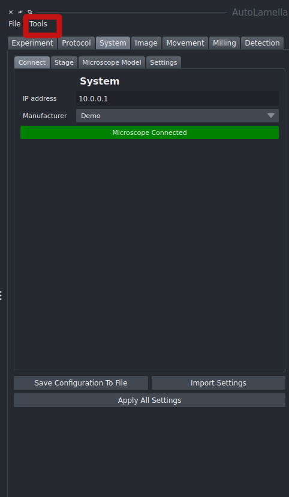
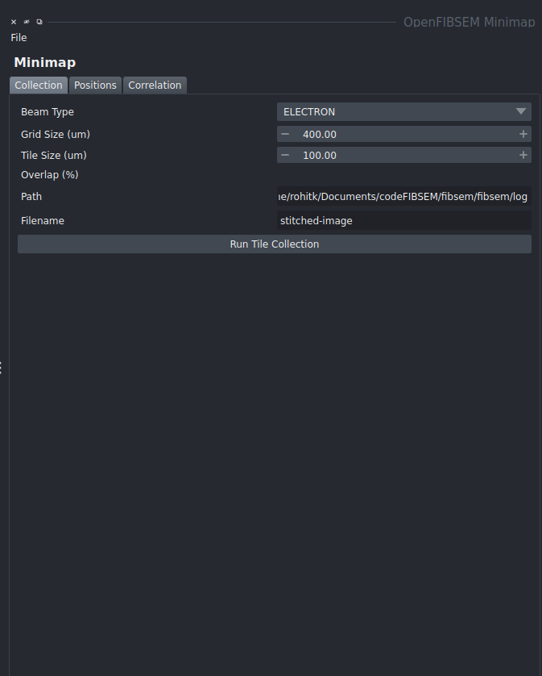

# Features

## Minimap

The minimap tool allows the user to create a map of a cryo-EM grid as a whole at high resolution to allow for easy navigation and selection of possible lamellae locations. The minimap is created by taking a grid of high resolution images from either the SEM or FIB and stitching the images together to form a map. The minimap tool can be accessed from the tools menu.

The minimap tool opens in a seperate window, where the user can select the grid size and the tile size. The tile size is the size of the image taken for each subsection to form the whole grid. Once the parameters have been set, click run tile collection to run the process

Once the minimap is created, positions can be added and correlated. From here, you can also move to the selected position by clicking move to position. 

#TODO ADD better picture of positions with tiled images

A more detailed and in depth follow through of the minimap can be found in this [video](https://www.youtube.com/watch?v=zzH2XJB3OSc)

## Supervision

The supervision parameter outlines how much of the process can be user supervised. The example outlined shows the process being fully supervised. This ensures that the user has control of milling parameters before running, detected features and the ability to redo milling if necessary.

The process can be done fully unsupervised if required. You may also selectively supervise and unsupervise relevant stages as necessary. In the protocol tab under supervision, the supervision checkbox can be set for each stage.

## Workflows

As outlined in the walkthrough, there are two main workflows available. The standard autolamella workflow labelled as Default and the waffle method labelled as Waffle.

With the default method, the lamellae are milled in a standard fashion. The waffle method involves milling trenches in a way to allow for undercuts to be performed. Once the trenches are milled, the undercuts are performed and the lamellae are milled in the same fashion as the default method.

## Time Travel

The time travel feature allows the user to bring the lamella back to any of its previous states, to allow for repetition of any part of the process. 

## Lamella Protocol

[Protocol walkthrough](protocol.md) 

## Statistics, Data and Logging

The tools folder in the project directory contains a number of useful tools for analysing data and logging. The stats.py file allows the user to generate statistics from the data collected during the autolamella process. The stats.py file can be run from the command line using the following command:

streamlit run stats.py

The experiments analytics include information about the following:

- The number of lamellas that went through each stage of the process ( Trenches, Undercut, Polish)
- The experiment timeline
- The durtion of each step with reference images
- Each lamella's history

