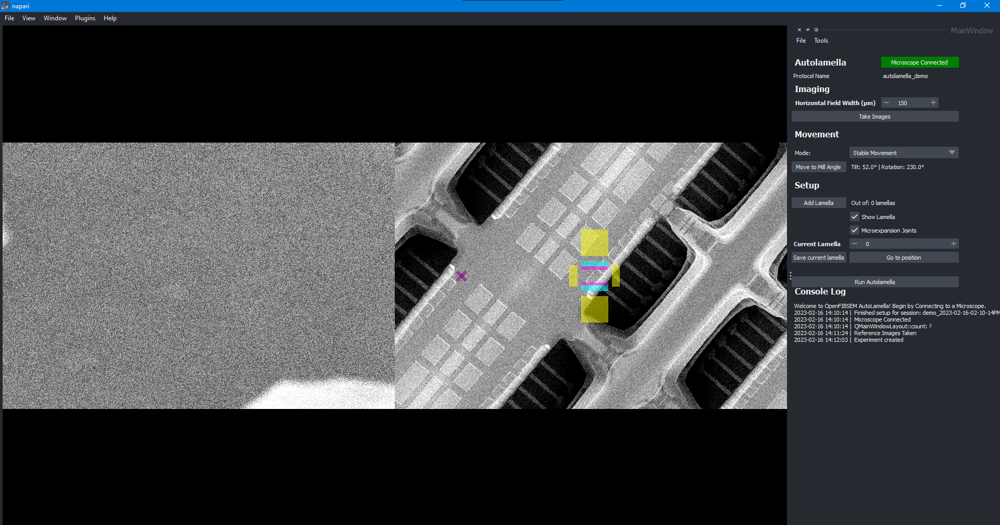

## Install

### Install OpenFIBSEM
Clone this repository: 

```
$ git clone https://github.com/DeMarcoLab/fibsem.git
```

Install dependencies and package
```bash
$ cd fibsem
$ conda env create -f environment.yml
$ conda activate fibsem
$ pip install -e .

```
### Install autolamella package
Clone this repository: 

```
$ git clone https://github.com/DeMarcoLab/autolamella.git
```

Install dependencies and package
```bash
$ conda activate fibsem
$ cd autolamella
$ pip install -e .

```

### Install AutoScript
You will also need to install AutoScript 4.6+. 

Please see the [Installation Guide](INSTALLATION.md) for detailed instructions.

Copy AutoScript /into home/user/miniconda3/envs/fibsem/lib/python3.9/site-packages/

### Install TESCAN Automation SDK

Ideally, please install and set up the conda environment first before proceeding to install this SDK

Run the Tescan-Automation-SDK-Installer-3.x.x.exe file

When asked for the python interpretor, select the existing conda environment for FIBSEM, if this python interpretor is not available, see detailed installation guide for a work around

See [Installation Guide](INSTALLATION.md) for full details


### Getting started 


