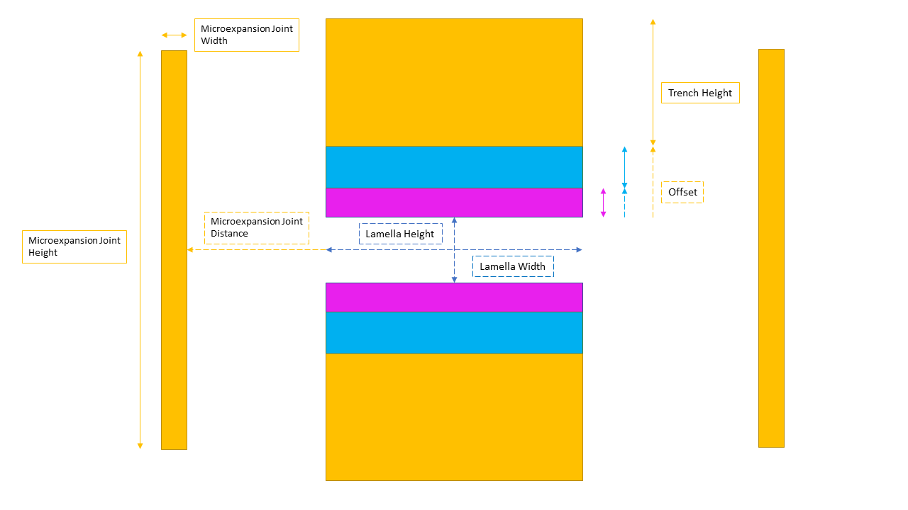

# AutoLamella Protocol
The new AutoLamella program utilises the OpenFIBSEM code package to build a more streamlined and robust automated lamella workflow that includes a new user interface. This updated AutoLamella program also includes a more intuitive system for the lamella protocol. AutoLamella protocol's should now be easier to make, without requiring any calculations. 

## Waffle Method

The waffle method is a new method of milling lamellae that allows for undercuts to be performed. The waffle method involves milling trenches in a way to allow for undercuts to be performed. Once the trenches are milled, the undercuts are performed and the lamellae are milled in the same fashion as the default method.

The lamella height and width are specified in the protocol, as well as the height and width of the rectangles that make up the waffle pattern. The protocol also includes the milling current/preset to be used when milling, as well as the size ratio of the trenches.

The undercuts are defined as rectangle patterns of a given height and width. The tilt angles are also specified. 

## The new lamella protocol format


Each of the colours indicates a different protocol stage. In this case there are three: Rough Cut in yellow, Regular Cut in blue, and Polishing Cut in magenta. Additionally the optional microexpansion joints are indicated in yellow as they are milled during the Rough Cut stage if the user opts to use them. 

The Lamella width and height are indicated at the centre, and must be input for each protocol stage. The placement of each trench is based on two factors: the offset, and the trench height. For example, the Polishing Cut (magenta) has an offset of 0 as it is situated directly above and below the Lamella, and in our default protocol example, has a trench height of 1e-6m. The Regular Cut (blue) has an offset of 1e-6m, and a trench height of 2e-6m. Finally, the offset of the Rough Cut (yellow) is the cumulative trench height of the previous stages, 3e-6m; and has a trench height of 10e-6m. It should be mentioned that in practice the order of the protocol stages would be the reverse, as the stages are milled sequentially, it is just easier to explain in this manner. Additionally, if you would like overlap between stages, the offset of the stage simply needs to be less than the cumulative trench heights of the other stages.

As previously mentioned the microexpansion joints are optional and can be enabled/disabled in within the UI. If they are enabled they must have the height, width, and distance from the Lamella within the protocol. The distance does NOT include the Lamella width itself, and is accounted for when milling.

If running the waffle method, a notch is used instead of microexpansion joints. The protocol specifies all the milling settings, as well as the dimensions of the patterns: height and width for the vertical rectangles and for the horizontal ones. The distance between the rectangles is also specified. The distance is the distance between the centre of the notch and the centre of the lamella, and does not include the width of the rectangles themselves. The distance is accounted for when milling.

Optionally, a fiducal mark can be used for beam alignment during the lamella milling process.
The fiducial requires the width and height of a rectangle, which will then be rotated +/- 45 degrees to create the 'X'.  

Additionally, the number of attempts the program should make when attempting to align the imaging beam to the fiducial should be stored within the Lamella section of the protocol. You can also specify whether to align at the imaging current or the milling current of each stage.

Finally, here is what a completed protocol in the new format might look like as a .yaml file:

```yaml
name: autolamella_demo
application_file: Si # Thermo only
method: waffle
ml: # machine learning parameters 
    encoder: resnet34
    num_classes: 3
    checkpoint: model4.pt #model4.pt
options:
    supervise:
        features: false
        lamella: true
        setup_lamella: true
        trench: true
        undercut: true
trench:
    application_file: autolamella
    cleaning_cross_section: false
    depth: 1.0e-06
    hfw: 0.00018
    lamella_height: 2.5e-05
    lamella_width: 2.2e-05
    milling_current: 7.6e-09
    offset: 0.0
    preset: 30 keV; 2.5 nA
    size_ratio: 2.0
    trench_height: 3.2e-05
undercut:
    application_file: autolamella
    cleaning_cross_section: false
    depth: 1.0e-06
    height: 8.0e-06
    hfw: 8.0e-05
    milling_current: 7.6e-09
    preset: 30 keV; 2.5 nA
    tilt_angle: -5.0
    tilt_angle_step: 2.0
    width: 22.0e-6
fiducial:
  application_file: autolamella
  cleaning_cross_section: false
  depth: 1.0e-06
  enabled: true
  height: 1.0e-05
  hfw: 8.0e-05
  milling_current: 2.0e-09
  passes: null
  preset: 30 keV; 20 nA
  rotation: 45
  width: 1.0e-06
lamella:
  alignment_current: Imaging Current
    beam_shift_attempts: 3.0
    lamella_height: 8.0e-07
    lamella_width: 1.0e-05
    stages:
    -   application_file: autolamella
        cleaning_cross_section: true
        depth: 2.0e-06
        hfw: 8.0e-05
        lamella_height: 8.0e-07
        lamella_width: 14.0e-6
        milling_current: 2.0e-09
        offset: 2.0e-06
        preset: 30 keV; 2.5 nA
        size_ratio: 2.0
        trench_height: 1.0e-05
    -   application_file: autolamella
        cleaning_cross_section: true
        depth: 1.0e-06
        hfw: 8.0e-05
        lamella_height: 8.0e-07
        lamella_width: 1.4e-05
        milling_current: 7.4e-10
        offset: 5.0e-07
        preset: 30 keV; 1 nA
        size_ratio: 1.0
        trench_height: 2.0e-06
    -   application_file: autolamella
        cleaning_cross_section: true
        depth: 4.0e-07
        hfw: 8.0e-05
        lamella_height: 6.0e-07
        lamella_width: 1.4e-05
        milling_current: 6.0e-11
        offset: 0.0
        preset: 30 keV; 50 pA
        size_ratio: 1.0
        trench_height: 5.0e-07
microexpansion:
  application_file: autolamella
  cleaning_cross_section: false
  depth: 1.0e-06
  distance: 1.0e-05
  height: 1.8e-05
  hfw: 200e-6
  lamella_width: 1.0e-05
  milling_current: 2.0e-09
  preset: 30 keV; 2.5 nA
  width: 5.0e-07
```

## How to convert to the new protocol format
A tool has been created to automatically convert an old protocol file to the new format. 

Simply navigate to the autolamella folder that contains protocol_converter.py in a terminal and write the following:

```shellscript
python protocol_converter.py("path/old_protocol.yaml", "path/new_protocol.yaml")
```

The first argument refers to the curent file path of the old protocol yaml file. The second location indicates the file location you would like the converted protocol yaml file saved to.