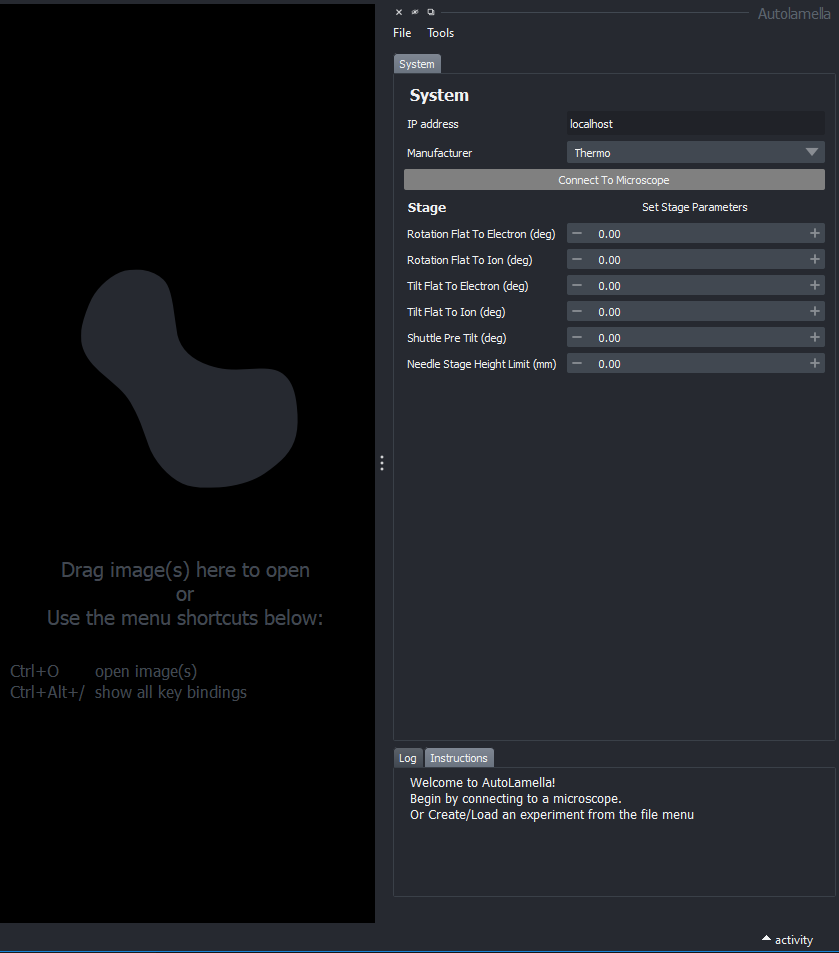
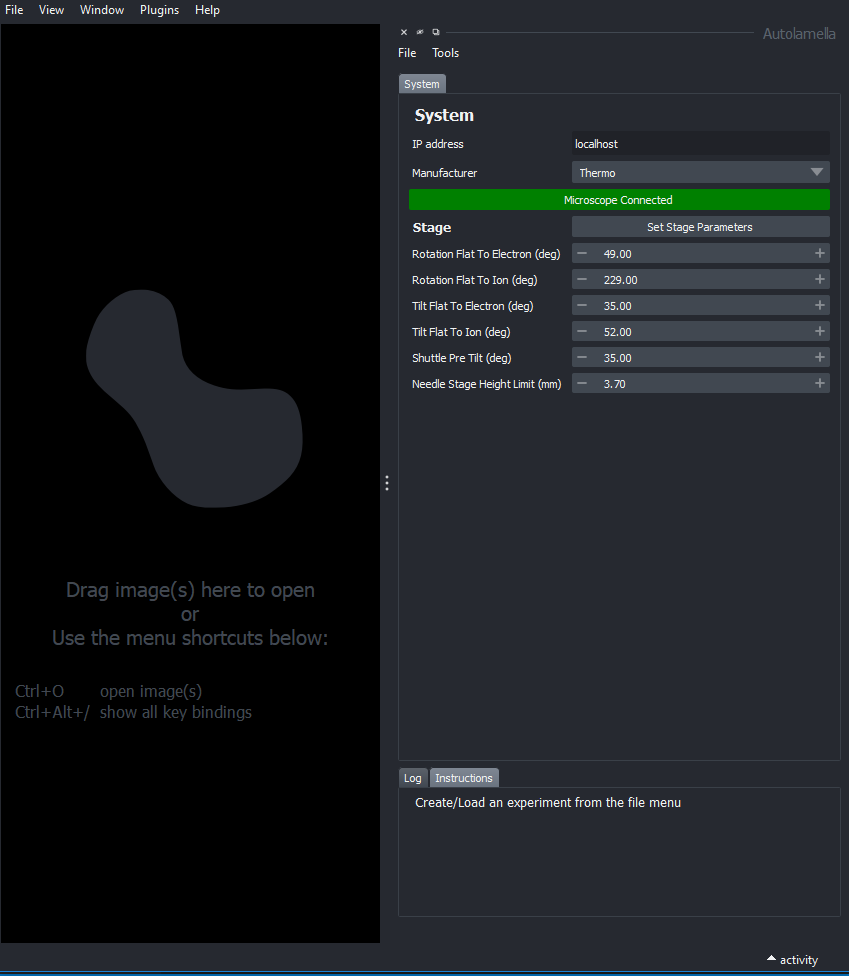
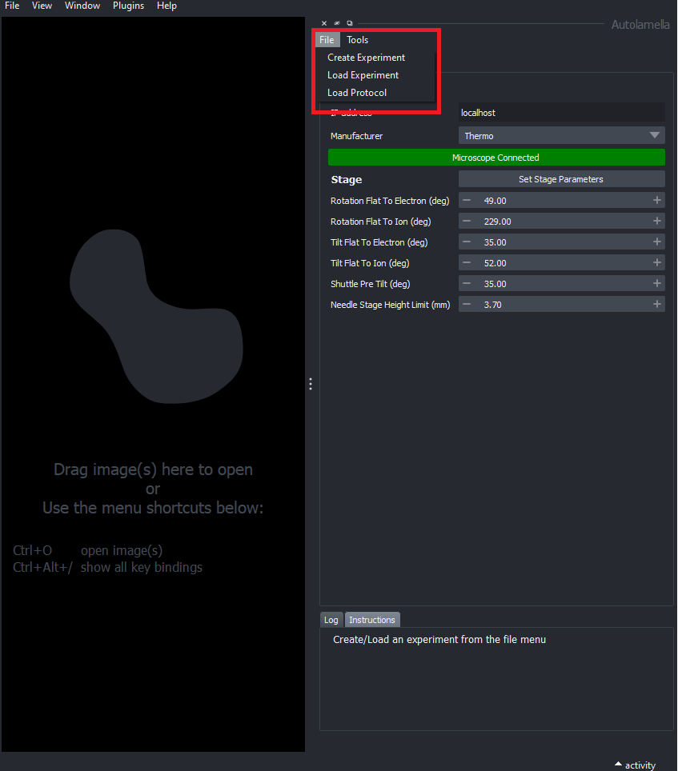
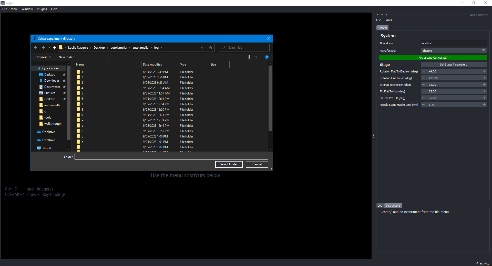
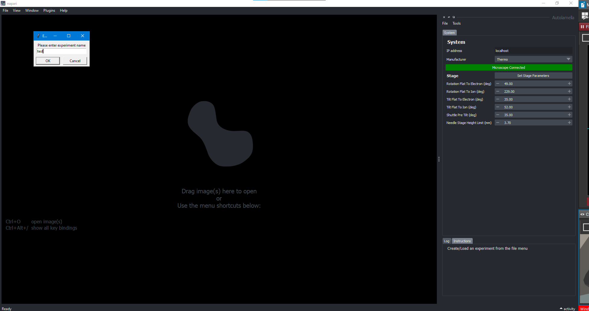
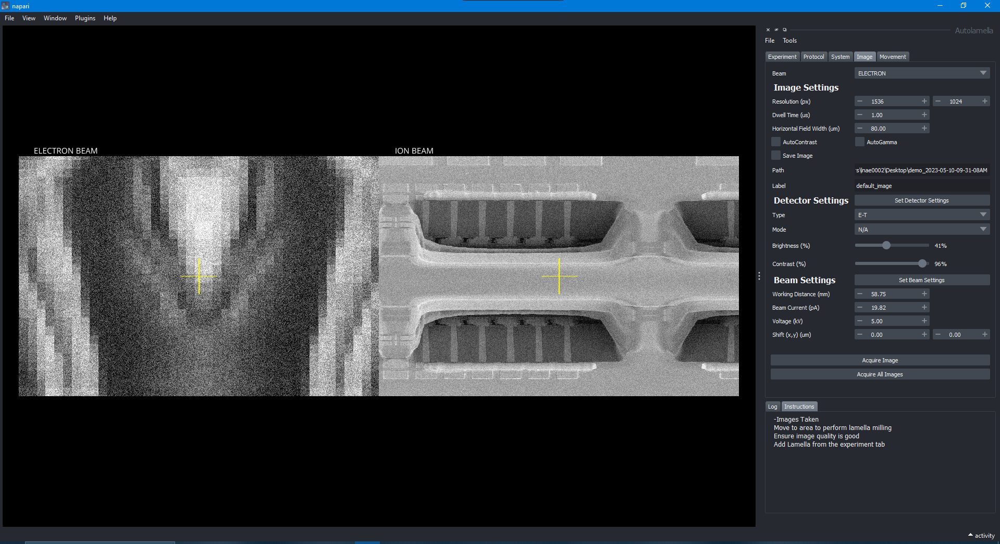
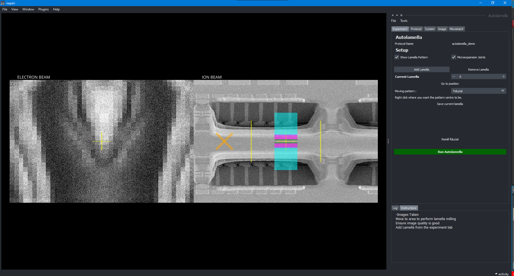
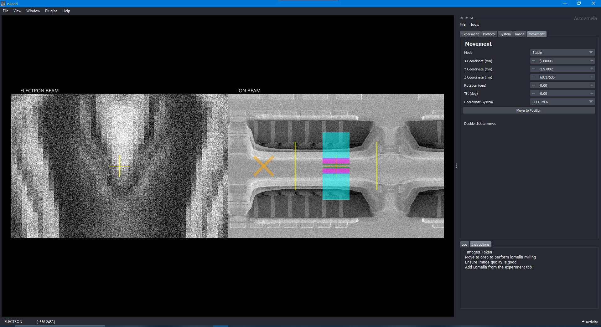

# Walkthrough
The following is a short explanation of the basic workflow of the AutoLamella program. 

## Step 1: Creating a protocol
The AutoLamella package uses a yaml file to store all of the necessary information on the dimensions and characteristics of the fiducial, lamella, and optional microexpansion joints such as the width and height of the lamella, in how many stages the lamella trenches are milled, the dimensions of each stage, milling current, etc. The protocol format was updated alongside the rest of the AutoLamella package, as such an in-depth explanation of what all the values in the new protocol format are and how to convert from the old protocol format to the new one can be found in the [AutoLamella Protocol](protocol.md) section. 

## Step 2: Connecting to a microscope
The first thing to do when opening the AutoLamella program is to connect to a microscope. This can be done by entering the IP address of the microscope you would like to connect to in the 'IP adress' field and selecting the correct manufacturer, then clicking the 'Connect' button. 

   

Once the hardware is properly connected, the status bar will update, as well as the stage parameters, which can be updated by clicking the 'Set Stage Parameters' button.

## Step 3: Creating/Loading an Experiment
AutoLamella requires an Experiment to be created/loaded before any saving and milling of lamellae can begin. An 'Experiment' groups all of the fiducials and lamellae into a single object that is logged and saved upon any updates to any of the current lamellae or any additions. The Experiment is automatically saved, this does not need to be done by hand and can then be loaded again later by importing the .yaml file. To create/load an experiment:

Once you have navigated to either creating or loading an experiment, you will be prompted to either select a directory to save the experiment to in the case of Experiment creation, or select the filepath of the Experiment's yaml file in the case of loading an Experiment. 

If you are creating a new Experiment, you will also be prompted to select a name for the Experiment. A folder will be created with the name of the Experiment that will store all of the necessary files within (such as the yaml file that can later be used to load the Experiment).

Finally, you will be prompted to choose a protocol file to load (.yaml). Select (one of) the protocol file(s) you created in Step 1 to begin. If you would like to later change the protocol you are using, you can do so by navigating through file > load protocol.

You can update/verify the protocol by navigating to the protocol tab. 

## Step 4: Adding Lamellae
You will first need to take atleast one set of reference images before adding any lamellae to the Experiment. This can be done by simply clicking the 'Acquire All Images' button in the imaging tab of the UI. 

Once images have been taken, you can optionally tick the 'Show Lamella' and 'Microexpansion Joints' checkboxes. The 'Show Lamella' checkbox will draw the lamella and fiducial patterns onto the napari viewer over the ion beam image when ticked, to help you visualise what the lamella will look like. The 'Microexpansion Joints' checkbox will add stress relief joints to the sides of the lamella, if the microexpansion attributes were added to the protocol. Microexpansion joints will be milled as the first stage of the lamella if selected.

An empty lamella can be created by pressing the 'Add Lamella' button in the UI. Nothing happens after pressing this button besides telling AutoLamella how many lamellae you are working with. A lamella (and fidicual) is not properly created until you click the 'Save Lamella' button, upon which a fiducial will be milled for said lamella. You can either sequentially 'Add Lamella' and 'Save Lamella' as needed, or if you are aware of how many lamellae you are planning to mill for a particular experiment, you can add X number of lamellae all at once, and save them later. You can select which lamella you would like to save with the 'Current Lamella' bar. The fiducial and lamella patterns can be moved within the bounds of the ion beam image. Simply select the pattern you would like to move via the comboBox on the side of the UI, and right click on the desired location.

You can move the microscope stage by either double clicking on somewhere on one of the images to move there, or via the movement tab. 

Once you are happy with the placement of a lamella, click 'Save Lamella'. This will begin the milling process of the fiducial, and save the lamella's position. Once a lamella has been saved, its position can not be changed. Remill the fiducial if needed. Once you have saved the desired number of lamellae and milled a fiducial for each, the AutoLamella process can begin.

## Step 5: Run AutoLamella
Click the 'Run AutoLamella' button to begin the process. The program will check behind the scenes that you have met the prerequisites before beginning. If you do not meet these prerequisites a pop-up message will let you know. These prerequisites are:

    1. A microscope is connected.
    2. An experiment has been loaded/created.
    3. Atleast one lamella has been added.
    4. Each lamella has atleast milled a fiducial.

If these prerequisites are met the process will begin. The milling order is by protocol stage. So the program will loop through each lamella milling just the first stage, then second, then third, etc. After each lamella has had a stage milled, the Experiment is saved and that lamella's history is logged. This means that if the process stops during running the Experiment can be loaded again and will begin where it left off.

