# Walkthrough

This is a general walkthrough on running an autolamella workflow. Further details can be viewed in their respective documentation and some are linked within this walkthrough.

## Methods

The autolamella program has incorporated two possible workflows that can be achieved. One is the default auto lamella workflow which is the standard lamella preparation workflow. The other is the waffle method workflow which has been recently developed as outlined in this [paper](https://www.nature.com/articles/s41467-022-29501-3). 

From a user interface perspective, both methods can be setup and run in a near identical fashion. The core processes of selecting lamella positions, milling parameters, supervision and monitoring can be set up the same way for both methods.

## Connection and Setup

The first step is to connect to the microscope. This can be setup to be done manually or automatically if the system parameters are setup in the system.yaml file.

To connect, first launch the autolamella program. Then in the connect tab (Under the system tab), enter the IP address of the microscope server and select the manufacturer of the microscope. Then click connect. 

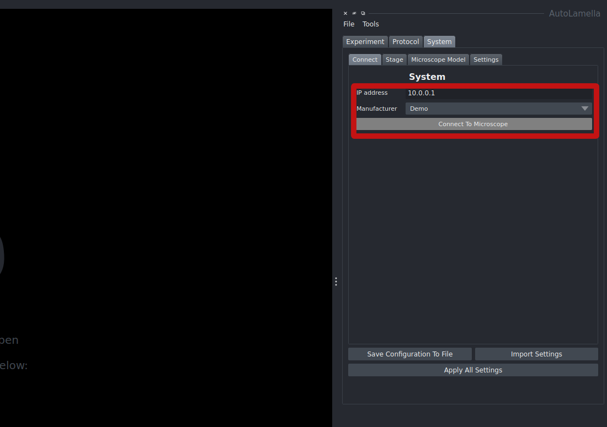

Once connected, create an experiment from the file menu by clicking create experiment. This will prompt you to choose a location to save the experiment folder which contains the experiment.yaml file. 

Once an experiment has been created, the experiment can be reloaded anytime by clicking load experiment from the file menu. This will prompt you to select the experiment.yaml file to load.

The next step is to load a protocol. Select load protocol from the file menu. This will prompt you to select a protocol.yaml file to load. A default one is provided, however, it can be modified to suit your needs. In the protocol tab, changes can be made and then saved. Details on each parameter is explained in the features section of the documentation. !! LINK TO FEATURES !! #TODO

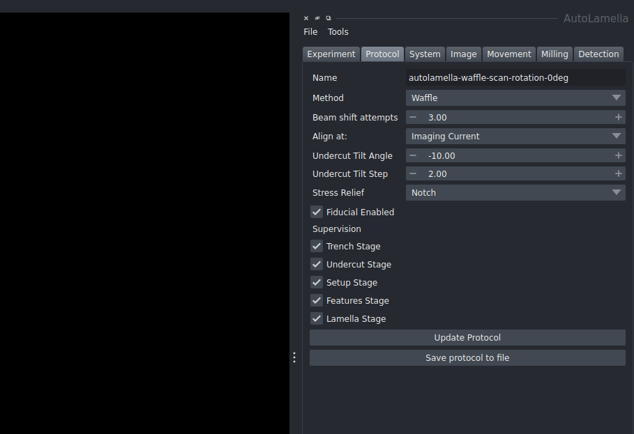

To update the changes for the current session, click update protocol. To save these changes to a new protocol file, click save protocol. This will prompt you to select a location to save the protocol.yaml file. 

## Adding Lamellae

Once the system is setup, the first step is to acquire images and move to a location for creating a lamella. This can be done by clicking acquire all images in the imaging tab. This will acquire all the images and display them in the napari viewer. To move, directly to some coordinates, you can move to a position in the movement tab. Alternatively, you can also click on the image to move to that position. The movement tab also has controls for tilting and moving flat to the ion or electron beam.

Once at a desired location, click add lamella to add a lamella to the experiment. This will setup a position. To move around, double clicking on the image will move the stage to that position. Alternatively, you can also move to a position in the movement tab. 

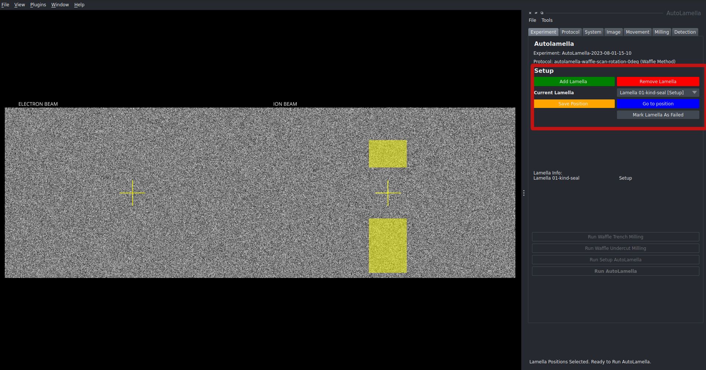

This image shows an example of the setup when using the waffle method workflow. However, the initial placement phase is identical for the default workflow. 

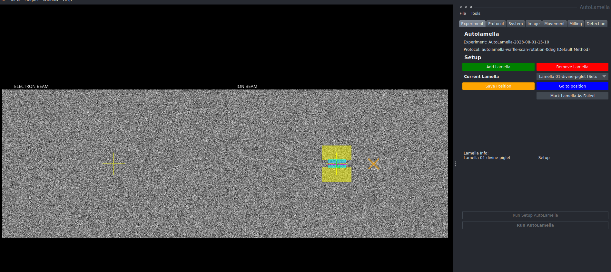

To remove a lamella, click remove lamella and this will remove it from the experiment. The dropdown next to current lamella can be used to select a lamella individually and remove it or change its placement as necessary.
Once satisfied with the placement, click save position to confirm its location. Additional lamellae can be added and saved in the same way. Once all the lamellae location have been saved, the process can continue to the next step.

## Workflow

The process now diverges based on which workflow is being used. 

### Default Workflow

#### Setup

With lamellae chosen and position saved. The button labelled "Run Setup Autolamella" will be highlighted. Clicking this will begin the process of setting up the lamellae and confirming the position. 

To make any changes to the milling parameters, click on the milling tab. In the dropdown labelled milling stage, the specific aspect can be selected. The paraemters such as width and height can then be changed. 

For multiple lamellae, the program will iterate through the lamellae and setup each one. Each individial lamella has its own state saved.

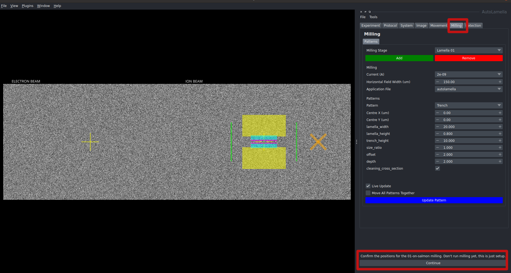

Changes to the fiducial, microexpansion or notch can also be done here. Once satisfied with the process, press the continue to progress through the setup into the milling process. If a fiducial is being used, it will mill the fiducial at this stage.

#### Run Autolamella

Once setup is complete and the program is ready to run autolamella, click the Run Autolamella button in the experiment tab to begin the process. This will begin the process of milling the lamella.

It will now run through each stage in the lamella preparation phase. Press run milling in the milling tab to run the milling process in each stage. Once again, any last minute changes can be made at the milling tab. 

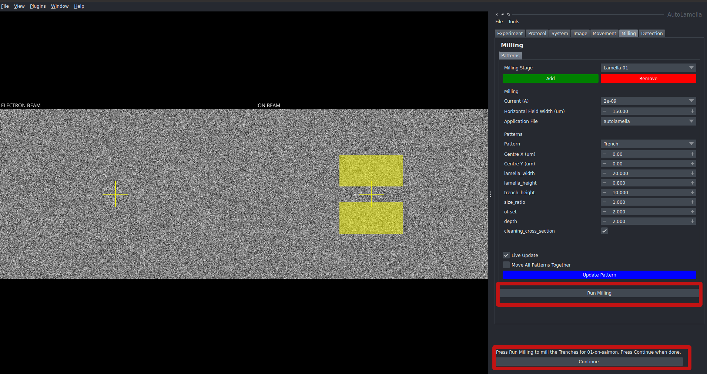

If milling is unsatisfactory, changes can be made and the milling process can be redone by clicking Run Milling again. Once satisfactory, click continue to move to the next stage. 

The program will run through each stage on multiple lamellae before moving onto the next stage. i.e. it will mill the rough trenches for all the lamellae before moving onto the next stage for any lamella.

Once all the stages have been completed and the lamellae have been prepared, the experiment is complete. In the main experiment tab, the status of each lamella will be marked as finished.

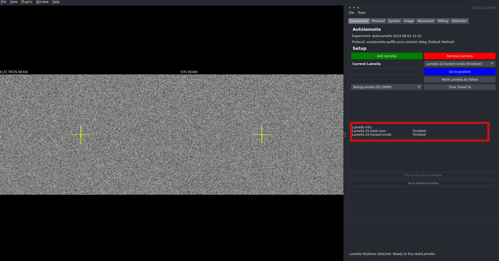

### Waffle Method

The waffle method for lamella preparation involves a different workflow. 

The initial trenches are milled in a way to allow for undercuts to be performed. Once these are done, the lamellae are milled in the usual fashion as the default workflow

#### Waffle Trenches

Once the positions have been selected as outlined above, click Run Waffle Trench Milling to begin the process

Similar to the default workflow, at each stage, the program will iterate through each stage for each lamella and allow you to make changes to the milling if necessary. If the milling is unsatisfactory, click Run Milling again to redo the milling. Once satisfied, click continue to move to the next stage.

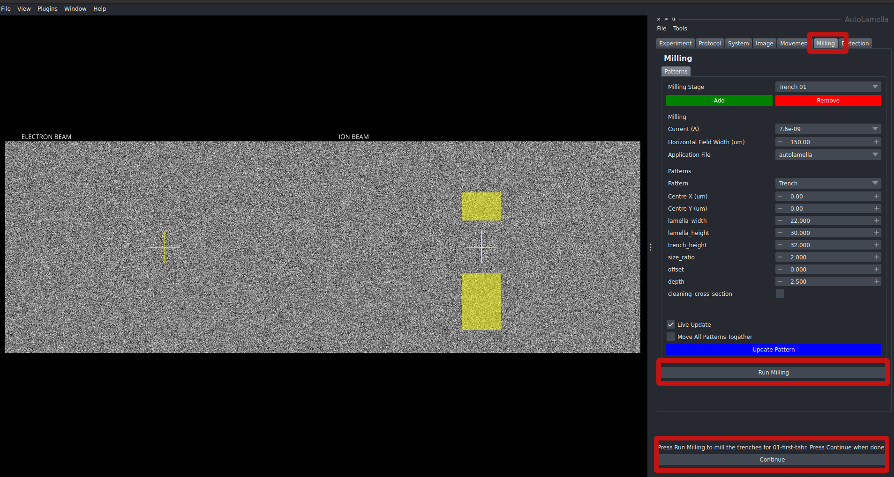

#### Waffle Undercut

Once the waffle trenches have been milled, the next step is to perform undercuts on the lamellae. The Run waffle Undercut Milling button will be highlighted. Clicking this will begin the process of undercutting the lamellae.

If the trench milling was unsuccessful and cannot be redone, you can mark the specific lamella as Failed. This will skip the rest of the process for that lamella. The status of the lamella will be marked as failed in the main experiment tab.

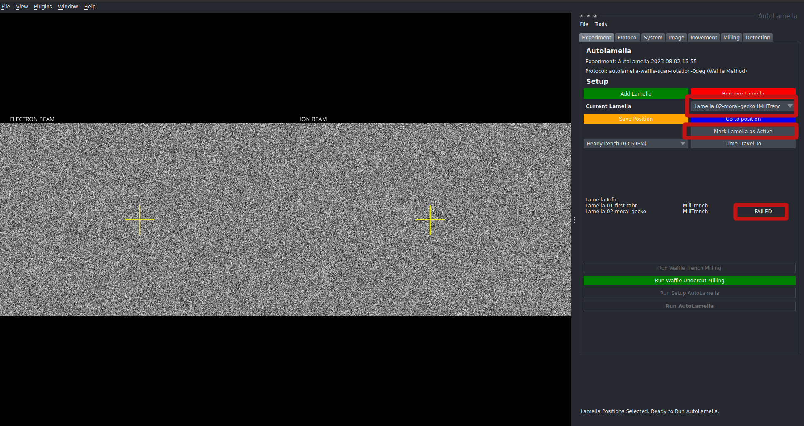

The undercut milling begins by first identifying the location of the lamella centre, this brings up the detection tab where the user can verify that the lamella centre has been detected correctly by the program. If incorrect, the centre location can be manually adjusted by dragging the location point.

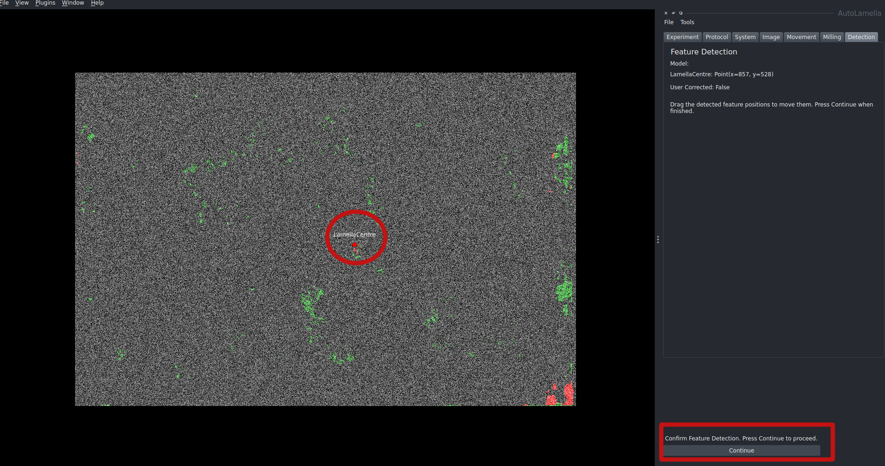

Once detection is verified, the stage will tilt to the specified undercut tilt angle and relaunch the centre verification process from the tilted angle. Once the centre location has been verified, it will return to the milling tab to confirm the milling step. As usual, any changes to be made can be done so and remilling can be done until result is satisfactory. Once satisfied, click continue to move to the next stage.

The program will continue to tilt to the next undercut and rerun the process. By default, there are two undercuts, however, any number of undercuts can be set up.

It will perform all the undercuts for each lamella before moving onto the subsequent lamella

Once the undercuts are done, the next stages are identical to the default workflow. In the main experiment tab, the Run Setup Autolamella will be highlighted and the process can continue as outlined above.

## Supervision

The supervision parameter outlines how much of the process can be user supervised. The example outlined shows the process being fully supervised. This ensures that the user has control of milling parameters before running, detected features and the ability to redo milling if necessary.

The process can be done fully unsupervised if required. You may also selectively supervise and unsupervise relevant stages as necessary. In the protocol tab under supervision, the supervision checkbox can be set for each stage.

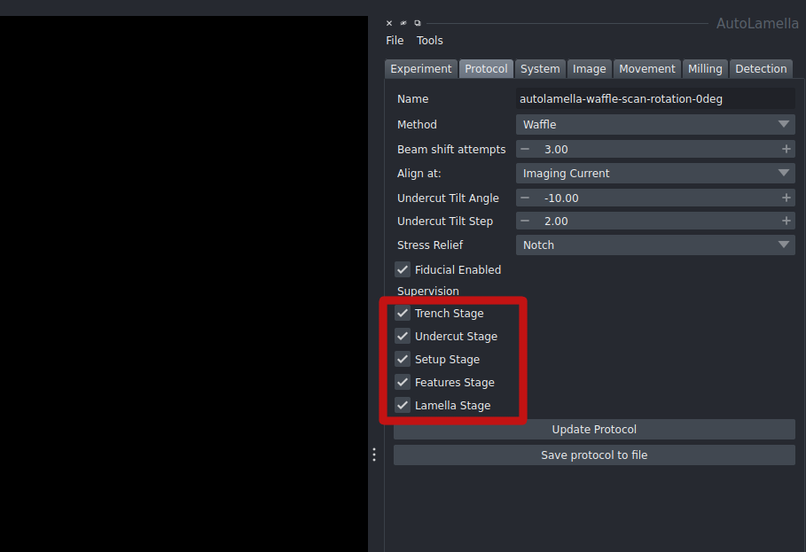

